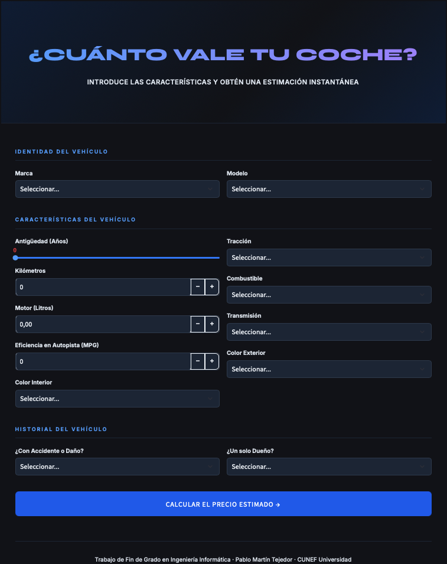
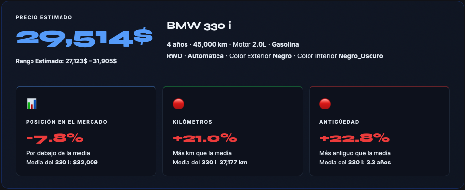

# 🚗 Used Car Price Prediction

### Interactive Web Application powered by XGBoost

**Computer Engineering Final Degree Project · CUNEF Universidad**

### 🌐 [**Try the App Live**](https://pablomartin-tfg.streamlit.app)

---

## 📌 Overview

This project is the deployment-ready demonstration of a **Computer Engineering Final Degree Project** focused on predicting **used car prices** using machine learning. An XGBoost regressor was trained on a dataset of approximately **746,587 real listings** scraped from Cars.com, achieving an **R² of 95.60%** and a mean absolute error of **$2,453**.

The model is exposed through an interactive web application built with **Streamlit**. Users introduce the characteristics of a vehicle (make, model, mileage, age, engine size, transmission, etc.) and obtain an instant price estimation along with comparative cards that contextualize the prediction against the market average for that specific model.

---

## 🎯 Key Features

- **Real-time price prediction** with a single click.
- **Smart input restrictions** by manufacturer (e.g. Tesla → electric only, Land Rover → automatic only).
- **Dynamic model dropdown** that updates based on the selected manufacturer.
- **Comparative dashboard** showing how the predicted price, mileage and age relate to the model's market average.
- **Reliability warnings** when input values fall outside the dataset's training range.
- **Modern dark UI** designed for clarity and professional presentation.

---

## 🖼️ Application Preview

### Input Form

### Prediction Result

---

## 📊 Model Performance

The XGBoost regressor was selected as the winning model after benchmarking against six alternatives, including Linear Regression, Random Forest, Gradient Boosting, LightGBM, and a Multi-Layer Perceptron neural network. Final results on the test set:

| Metric | Value |
|---|---|
| **R² (Coefficient of Determination)** | **95.60%** |
| **MAE (Mean Absolute Error)** | **$2,453** |
| **MAPE (Mean Absolute Percentage Error)** | **8.10%** |
| **Number of features** | 13 |
| **Training set size** | 522,610 |
| **Validation set size** | 111,988 |
| **Test set size** | 111,989 |
| **Total models trained during optimization** | 4,453 |

---

## 🛠️ Tech Stack

| Layer | Technology |
|---|---|
| **Language** | Python 3.11 |
| **Machine Learning** | XGBoost, scikit-learn |
| **Data Manipulation** | pandas, NumPy |
| **Model Serialization** | joblib |
| **Web Framework** | Streamlit |
| **Deployment** | Streamlit Community Cloud |
| **Version Control** | Git, GitHub |

---

## 📂 Project Structure

- `app.py` — Main Streamlit application
- `requirements.txt` — Python dependencies
- `xgb_opt.pkl` — Trained XGBoost model (9.2 MB)
- `app_artifacts/` — Encoders and reference dictionaries
- `docs/` — Application screenshots
- `.gitignore`
- `README.md`

---

## 🚀 Run Locally

Clone the repository, install the dependencies and launch the app:

    git clone https://github.com/PabloMartinTejedor/Used-Car-Price-Prediction-App-Computer-Engineering-Final-Degree-Project.git
    cd Used-Car-Price-Prediction-App-Computer-Engineering-Final-Degree-Project
    python -m venv venv
    source venv/bin/activate
    pip install -r requirements.txt
    streamlit run app.py

The application will open automatically in your default browser at `http://localhost:8501`.

---

## 🎓 Academic Context

This application is the deployment of the experimental work conducted in the Final Degree Project:

> **"Predicting the Price of Used Cars: A Machine Learning Approach"**
> Author: **Pablo Martín Tejedor**
> Degree: **Double Bachelor in Computer Engineering and Business Administration**
> University: **CUNEF Universidad**
> Academic Year: **2025-2026**
> Advisor: **Juan Maroñas Molano**

---

## ⚠️ Disclaimer

This application is an **academic demonstration**. Predictions are based on a public dataset of US-based listings (Cars.com, April 2023) and may not generalize accurately to vehicles outside that market or sold under different economic conditions.

---

## 👤 Author

**Pablo Martín Tejedor**

🎓 Double Degree in Computer Engineering and Business Administration · CUNEF Universidad
📍 Madrid, Spain

---

⭐ **If you found this project interesting, consider giving it a star** ⭐

